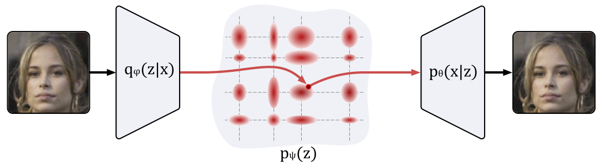

# A Prior of a Googol Gaussians: a Tensor Ring Induced Prior for Generative Models

Generative models produce realistic objects in many domains, including text, image, video, and audio synthesis. Most popular models—Generative Adversarial Networks (GANs) and Variational Autoencoders (VAEs)—usually employ a standard Gaussian distribution as a prior. Previous works show that the richer family of prior distributions may help to avoid the mode collapse problem in GANs and to improve the evidence lower bound in VAEs. We propose a new family of prior distributions—Tensor Ring Induced Prior (TRIP)—that packs an exponential number of Gaussians into a high-dimensional lattice with a relatively small number of parameters. We show that these priors improve Fr\'echet Inception Distance for GANs and Evidence Lower Bound for VAEs. We also study generative models with TRIP in the conditional generation setup with missing conditions. Altogether, we propose a novel plug-and-play framework for generative models that can be utilized in any GAN and VAE-like architectures.



# Repository

In this repository, we provide an implementation of the proposed Tensor Ring Induced Prior (TRIP) 
and include code for training VAE, WGAN and WGAN-GP with various learnable priors. 

A `core` folder provides an implementation of basic generative models and TRIP. `train_scripts` folder provides training scripts for both `VAE` and `GAN`-based models. Please refer to [`train_vaes.py`](./train_scripts/train_vaes.py) script to reproduce VAE experiments and to [`train_wgan.py`](./train_scripts/train_wgan.py) to reproduce GAN experiments. For more details and hyperparameter descriptions, see [experiments readme](./train_scripts).


## How to cite

```
@article{kuznetsov2019trip,
  title = {{A} {P}rior of a {G}oogol {G}aussians: a {T}ensor {R}ing {I}nduced {P}rior for {G}enerative {M}odels},
  author = {Kuznetsov, Maksim and Polykovskiy, Daniil and Vetrov, Dmitry and Zhebrak, Alexander},
  journal = {Advances in Neural Information Processing Systems},
  year = {2019},
}
```
